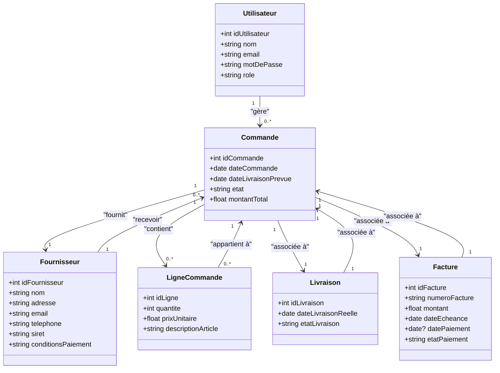

# Projet Système de Gestion des Achats et des Fournisseurs

# Démarrage du projet

Vous pouvez démarrer le projet directement via le script suivant :

```bash
sh start.sh
```

## Prérequis

1. **Vous devez avoir Docker installé sur votre ordinateur.**

## Étapes manuelles (si vous ne souhaitez pas utiliser `start.sh`) :

2. **Construire les conteneurs :**

   ```bash
   docker-compose build
   ```

3. **Démarrer le projet en mode détaché (en arrière-plan) :**

   ```bash
   docker-compose up -d
   ```

4. **Arrêter le projet :**

   ```bash
   docker-compose down
   ```

## 1. Introduction
Ce projet vise à développer un système de gestion des achats et des fournisseurs, permettant de suivre les commandes d'achat, la gestion des fournisseurs, les livraisons et les paiements. Le système doit offrir une interface web intuitive pour faciliter la gestion quotidienne des achats.

## 2. Objectifs du Projet
Le système doit permettre de :
- Gérer les commandes d'achats.
- Suivre l'état des livraisons des fournisseurs.
- Suivre les paiements effectués aux fournisseurs.
- Offrir une interface graphique responsive pour une utilisation fluide et efficace.

## 3. Technologies Utilisées
Le projet sera développé en utilisant les technologies suivantes :
- **Backend** : Spring Boot pour le développement des API et la logique métier.
- **Base de données** : PostgreSQL pour la gestion des données liées aux commandes, aux fournisseurs et aux paiements.
- **Frontend** : Angular ou React pour la création de l'interface utilisateur.
- **Architecture** : Architecture distribuée pour permettre une évolutivité et une gestion répartie des tâches.
- **ElasticSearch** pour le moteur de recherche.
- **Apache Kafka** pour les notifications en temps réel.

## 4. Architecture du Système
Le système sera conçu avec une architecture distribuée, où le backend sera composé de microservices déployés sur un serveur, et le frontend sera une application web accessible via un navigateur.  
L’architecture prévoit également la mise en place d’une base de données PostgreSQL pour le stockage des informations et des échanges entre les différentes parties du système.

## 5. Fonctionnalités du Système
1. **Gestion des Commandes d’Achat**  
   - Créer une commande d’achat avec les informations suivantes : numéro de commande, date, fournisseur, articles, quantités, prix unitaire, date de livraison prévue.
   - Modifier ou annuler une commande avant confirmation.
   - Valider une commande par un responsable avant envoi au fournisseur.
   - Suivre l’état d’une commande (en attente, validée, expédiée, livrée).
   - Recevoir des notifications pour les commandes en attente de validation.

2. **Gestion des Fournisseurs**  
   - Créer, modifier ou supprimer un fournisseur dans une base de données.
   - Stocker les informations des fournisseurs : nom, adresse, contact (email, téléphone), SIRET, conditions de paiement, historique des commandes.
   - Classer les fournisseurs par catégorie (ex. : fiabilité, type de produits fournis).

3. **Suivi des Livraisons**  
   - Enregistrer une livraison avec la date réelle de livraison et l’état (conforme, non conforme, partielle).
   - Recevoir des alertes en cas de retard de livraison par rapport à la date prévue.
   - Générer un bon de réception pour chaque livraison.

4. **Suivi des Paiements**  
   - Enregistrer les factures liées à une commande (numéro de facture, montant, date d’échéance).
   - Suivre les paiements effectués (date, mode de paiement, montant).
   - Recevoir des alertes pour les paiements en retard ou à venir.
   - Consulter l’historique des paiements par fournisseur.

5. **Rapports et Analyses**  
   - Générer un rapport mensuel sur les dépenses par fournisseur.
   - Analyser les délais de livraison (comparaison entre dates prévues et réelles).
   - Afficher un tableau de bord avec des indicateurs clés : nombre de commandes en cours, paiements en attente, livraisons retardées.

## 6. Diagramme de Classes (UML)



## 7. Planning de Développement
Le développement sera réalisé en plusieurs phases :
- **Phase 1** : Analyse des besoins et conception de l’architecture.
- **Phase 2** : Développement du backend avec Spring Boot et PostgreSQL.
- **Phase 3** : Développement du frontend.
- **Phase 4** : Tests et validation du système.
- **Phase 5** : Déploiement et mise en production.

## 8. Conclusion
Ce projet vise à créer un système robuste et sécurisé pour la gestion des achats et des fournisseurs. L'utilisation des technologies modernes permettra de garantir la performance, la sécurité et l'évolutivité du système, offrant ainsi une solution idéale pour une gestion optimale des achats.
